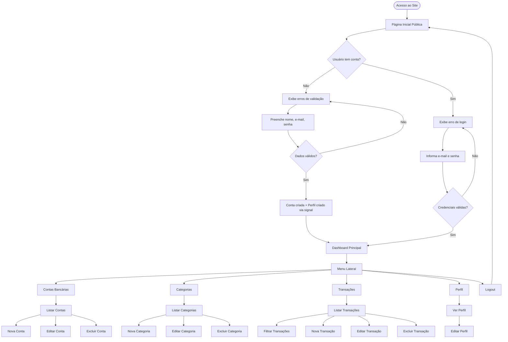
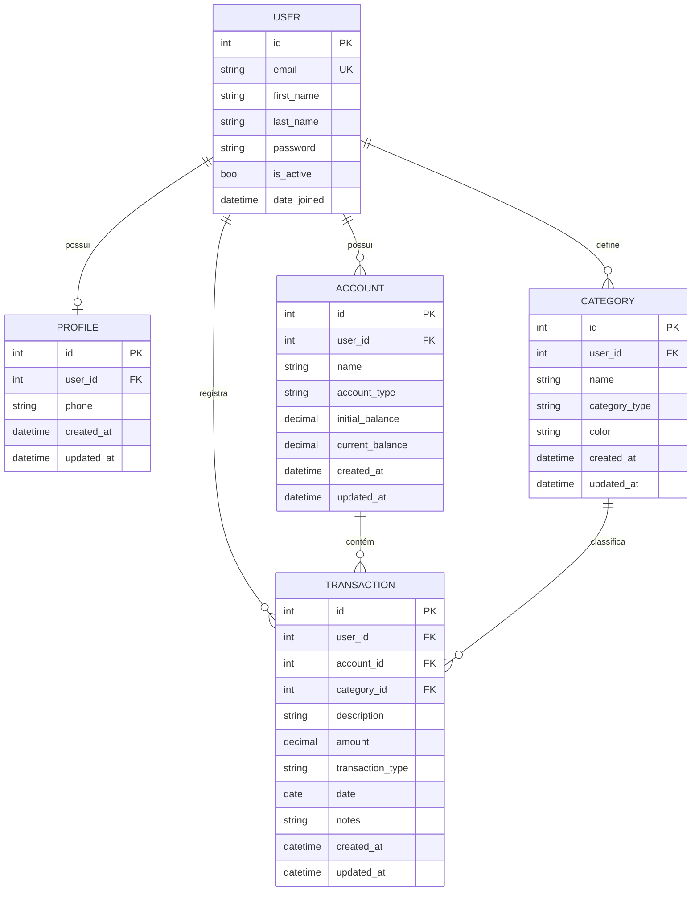

# PRD — my-denarius
## Sistema de Gestão de Finanças Pessoais

---

## 1. Visão Geral

O **my-denarius** é um sistema web de gestão de finanças pessoais desenvolvido com Django full stack. A plataforma permite que usuários registrem, categorizem e acompanhem suas transações financeiras (entradas e saídas), organizadas por contas bancárias e categorias personalizáveis. O sistema é simples, direto e focado na experiência do usuário final.

---

## 2. Sobre o Produto

| Atributo         | Detalhe                                              |
|------------------|------------------------------------------------------|
| **Nome**         | my-denarius                                          |
| **Tipo**         | Aplicação web (Django full stack)                    |
| **Frontend**     | Django Template Language + TailwindCSS               |
| **Backend**      | Python 3.x + Django                                  |
| **Banco de dados** | SQLite (padrão Django)                             |
| **Autenticação** | Django Auth nativo (login via e-mail)                |

> *"Denarius"* é uma moeda romana antiga — o nome reforça a ideia de controle e valor do dinheiro ao longo do tempo.

---

## 3. Propósito

Oferecer uma ferramenta simples, acessível e visualmente agradável para que qualquer pessoa possa controlar suas finanças pessoais, registrando receitas e despesas, organizando por categorias e contas, e acompanhando seu saldo e histórico de forma clara.

---

## 4. Público-Alvo

- Pessoas físicas que desejam controlar suas finanças pessoais
- Usuários sem experiência financeira avançada
- Pessoas que buscam uma alternativa simples a planilhas
- Faixa etária: 18 a 55 anos
- Perfil digital: usuários com acesso a navegador web (desktop e mobile)

---

## 5. Objetivos

### Objetivos de Produto
- Entregar um MVP funcional com cadastro, login, dashboard e CRUD de transações
- Garantir interface responsiva e moderna com identidade visual consistente
- Manter o sistema simples, sem funcionalidades desnecessárias

### Objetivos de Negócio
- Validar o produto com usuários reais nas primeiras sprints
- Construir base sólida e extensível para futuras funcionalidades

### Objetivos Técnicos
- Código limpo, legível e seguindo PEP8
- Separação de responsabilidades via Django apps
- Facilidade de manutenção e evolução

---

## 6. Requisitos Funcionais

### 6.1 Módulo: Site Público
- RF01 — Exibir página inicial pública com apresentação do produto
- RF02 — Botão de "Cadastre-se" na página inicial
- RF03 — Botão de "Entrar" (login) na página inicial

### 6.2 Módulo: Autenticação (users)
- RF04 — Cadastro de novo usuário com nome, e-mail e senha
- RF05 — Login via e-mail e senha (não por username)
- RF06 — Logout do sistema
- RF07 — Redirecionamento para dashboard após login bem-sucedido

### 6.3 Módulo: Perfil (profiles)
- RF08 — Criação automática de perfil ao cadastrar usuário (via signal)
- RF09 — Visualização e edição de dados do perfil

### 6.4 Módulo: Contas (accounts)
- RF10 — Listar contas bancárias do usuário
- RF11 — Criar nova conta bancária (nome, tipo, saldo inicial)
- RF12 — Editar conta bancária
- RF13 — Excluir conta bancária

### 6.5 Módulo: Categorias (categories)
- RF14 — Listar categorias do usuário
- RF15 — Criar nova categoria (nome, tipo: receita/despesa, cor/ícone opcional)
- RF16 — Editar categoria
- RF17 — Excluir categoria

### 6.6 Módulo: Transações (transactions)
- RF18 — Listar transações do usuário com filtros
- RF19 — Criar nova transação (descrição, valor, tipo, data, conta, categoria)
- RF20 — Editar transação
- RF21 — Excluir transação
- RF22 — Filtrar transações por período, tipo, conta e categoria

### 6.7 Módulo: Dashboard
- RF23 — Exibir saldo total consolidado de todas as contas
- RF24 — Exibir total de receitas e despesas do mês atual
- RF25 — Exibir lista das últimas transações

---

### 6.8 Flowchart — Fluxos de UX



---

## 7. Requisitos Não-Funcionais

| ID    | Requisito                                                                 |
|-------|---------------------------------------------------------------------------|
| RNF01 | Interface responsiva para desktop e mobile                                |
| RNF02 | Tempo de resposta das páginas inferior a 2 segundos                       |
| RNF03 | Código Python seguindo PEP8 rigorosamente                                 |
| RNF04 | Uso de Class Based Views sempre que possível                              |
| RNF05 | Separação de domínios em Django apps independentes                        |
| RNF06 | Todos os models devem ter campos `created_at` e `updated_at`             |
| RNF07 | Signals em arquivos `signals.py` dentro da app correspondente            |
| RNF08 | Banco de dados SQLite padrão Django                                       |
| RNF09 | Templates centralizados na pasta `templates/` na raiz do projeto         |
| RNF10 | Interface em português brasileiro                                         |
| RNF11 | Código-fonte (variáveis, funções, classes) em inglês                     |
| RNF12 | Aspas simples em todo o código Python                                     |
| RNF13 | Sem over-engineering — implementar apenas o que é solicitado              |

---

## 8. Arquitetura Técnica

### 8.1 Stack

| Camada         | Tecnologia                         |
|----------------|------------------------------------|
| Linguagem      | Python 3.12+                       |
| Framework      | Django 5.x                         |
| Frontend       | Django Template Language           |
| CSS Framework  | TailwindCSS (via CDN ou CLI)       |
| Banco de Dados | SQLite (padrão Django)             |
| Autenticação   | Django Auth nativo                 |
| Deploy (futuro)| Docker (sprints finais)            |
| Testes (futuro)| Django TestCase (sprints finais)   |

### 8.2 Estrutura de Dados — Schemas (Mermaid ERD)



### 8.3 Estrutura de Diretórios

```
MyDenarius/
├── accounts/               # App: contas bancárias
│   ├── migrations/
│   ├── __init__.py
│   ├── admin.py
│   ├── apps.py
│   ├── models.py
│   ├── tests.py
│   ├── urls.py
│   └── views.py
├── categories/             # App: categorias de transações
│   ├── migrations/
│   ├── __init__.py
│   ├── admin.py
│   ├── apps.py
│   ├── models.py
│   ├── tests.py
│   ├── urls.py
│   └── views.py
├── core/                   # Configurações globais do projeto
│   ├── __init__.py
│   ├── asgi.py
│   ├── settings.py
│   ├── urls.py
│   └── wsgi.py
├── profiles/               # App: perfis de usuários
│   ├── migrations/
│   ├── __init__.py
│   ├── admin.py
│   ├── apps.py
│   ├── models.py
│   ├── signals.py
│   ├── tests.py
│   ├── urls.py
│   └── views.py
├── transactions/           # App: transações financeiras
│   ├── migrations/
│   ├── __init__.py
│   ├── admin.py
│   ├── apps.py
│   ├── models.py
│   ├── tests.py
│   ├── urls.py
│   └── views.py
├── users/                  # App: usuários customizados
│   ├── migrations/
│   ├── __init__.py
│   ├── admin.py
│   ├── apps.py
│   ├── backends.py
│   ├── forms.py
│   ├── models.py
│   ├── tests.py
│   ├── urls.py
│   └── views.py
├── templates/              # Templates centralizados na raiz
│   ├── base.html
│   ├── partials/
│   │   ├── _navbar.html
│   │   ├── _sidebar.html
│   │   ├── _footer.html
│   │   ├── _messages.html
│   │   └── _breadcrumb.html
│   ├── public/
│   │   └── home.html
│   ├── users/
│   │   ├── login.html
│   │   └── register.html
│   ├── dashboard/
│   │   └── index.html
│   ├── accounts/
│   │   ├── list.html
│   │   ├── form.html
│   │   └── confirm_delete.html
│   ├── categories/
│   │   ├── list.html
│   │   ├── form.html
│   │   └── confirm_delete.html
│   ├── transactions/
│   │   ├── list.html
│   │   ├── form.html
│   │   └── confirm_delete.html
│   └── profiles/
│       └── detail.html
├── static/
│   └── css/
│       └── output.css      # TailwindCSS compilado
├── db.sqlite3
└── manage.py
```

---

## 9. Design System

Todo o design usa **TailwindCSS** dentro do **Django Template Language**. O padrão visual é moderno, limpo, com fundo claro e acento em verde.

### 9.1 Paleta de Cores

| Papel              | Classe Tailwind               | Hex       |
|--------------------|-------------------------------|-----------|
| Primária (verde)   | `bg-emerald-600`              | `#059669` |
| Primária hover     | `bg-emerald-700`              | `#047857` |
| Primária clara     | `bg-emerald-50`               | `#ECFDF5` |
| Gradiente hero     | `from-emerald-600 to-teal-500`| —         |
| Fundo principal    | `bg-gray-50`                  | `#F9FAFB` |
| Fundo de card      | `bg-white`                    | `#FFFFFF` |
| Texto principal    | `text-gray-800`               | `#1F2937` |
| Texto secundário   | `text-gray-500`               | `#6B7280` |
| Borda              | `border-gray-200`             | `#E5E7EB` |
| Receita (verde)    | `text-emerald-600`            | `#059669` |
| Despesa (vermelho) | `text-red-500`                | `#EF4444` |
| Alerta             | `text-yellow-500`             | `#F59E0B` |

### 9.2 Tipografia

```html
<!-- Fonte: Inter via Google Fonts (importada no base.html) -->
<link href="https://fonts.googleapis.com/css2?family=Inter:wght@400;500;600;700&display=swap" rel="stylesheet">

<!-- Títulos de página -->
<h1 class="text-2xl font-bold text-gray-800">Título</h1>

<!-- Subtítulos de seção -->
<h2 class="text-lg font-semibold text-gray-700">Subtítulo</h2>

<!-- Texto de corpo -->
<p class="text-sm text-gray-600">Conteúdo</p>

<!-- Label de formulário -->
<label class="block text-sm font-medium text-gray-700">Label</label>
```

### 9.3 Botões

```html
<!-- Botão Primário -->
<button class="inline-flex items-center px-4 py-2 bg-emerald-600 hover:bg-emerald-700
               text-white text-sm font-medium rounded-lg transition-colors duration-200
               focus:outline-none focus:ring-2 focus:ring-emerald-500 focus:ring-offset-2">
  Salvar
</button>

<!-- Botão Secundário (outline) -->
<button class="inline-flex items-center px-4 py-2 border border-gray-300
               bg-white hover:bg-gray-50 text-gray-700 text-sm font-medium
               rounded-lg transition-colors duration-200">
  Cancelar
</button>

<!-- Botão de Perigo (exclusão) -->
<button class="inline-flex items-center px-4 py-2 bg-red-600 hover:bg-red-700
               text-white text-sm font-medium rounded-lg transition-colors duration-200">
  Excluir
</button>

<!-- Botão pequeno (ação em tabela) -->
<button class="px-3 py-1 text-xs font-medium rounded-md">...</button>
```

### 9.4 Inputs e Formulários

```html
<!-- Input padrão -->
<input type="text"
       class="block w-full px-3 py-2 border border-gray-300 rounded-lg
              text-sm text-gray-800 placeholder-gray-400
              focus:outline-none focus:ring-2 focus:ring-emerald-500 focus:border-emerald-500
              transition-colors duration-200">

<!-- Select padrão -->
<select class="block w-full px-3 py-2 border border-gray-300 rounded-lg
               text-sm text-gray-800 bg-white
               focus:outline-none focus:ring-2 focus:ring-emerald-500 focus:border-emerald-500">
</select>

<!-- Grupo de formulário -->
<div class="space-y-4">
  <div>
    <label class="block text-sm font-medium text-gray-700 mb-1">Campo</label>
    <input type="text" class="...input classes...">
    
      <p class="mt-1 text-xs text-red-500">{{ form.field.errors.0 }}</p>
    
  </div>
</div>

<!-- Card de formulário -->
<div class="bg-white rounded-xl shadow-sm border border-gray-200 p-6">
  <h2 class="text-lg font-semibold text-gray-800 mb-6">Título do Form</h2>
  <form method="post">
    <!-- campos -->
  </form>
</div>
```

### 9.5 Cards e Grid

```html
<!-- Grid de cards (dashboard) -->
<div class="grid grid-cols-1 md:grid-cols-2 lg:grid-cols-3 gap-6">

  <!-- Card de métricas -->
  <div class="bg-white rounded-xl shadow-sm border border-gray-200 p-6">
    <div class="flex items-center justify-between">
      <div>
        <p class="text-sm text-gray-500">Saldo Total</p>
        <p class="text-2xl font-bold text-gray-800">R$ 0,00</p>
      </div>
      <div class="p-3 bg-emerald-50 rounded-lg">
        <!-- ícone SVG -->
      </div>
    </div>
  </div>

</div>
```

### 9.6 Tabelas

```html
<div class="bg-white rounded-xl shadow-sm border border-gray-200 overflow-hidden">
  <table class="w-full text-sm">
    <thead class="bg-gray-50 border-b border-gray-200">
      <tr>
        <th class="text-left px-6 py-3 text-xs font-semibold text-gray-500 uppercase tracking-wider">
          Coluna
        </th>
      </tr>
    </thead>
    <tbody class="divide-y divide-gray-100">
      <tr class="hover:bg-gray-50 transition-colors duration-150">
        <td class="px-6 py-4 text-gray-700">Dado</td>
      </tr>
    </tbody>
  </table>
</div>
```

### 9.7 Sidebar e Navegação

```html
<!-- Sidebar lateral (sistema autenticado) -->
<aside class="w-64 bg-white border-r border-gray-200 min-h-screen flex flex-col">
  <!-- Logo -->
  <div class="px-6 py-5 border-b border-gray-200">
    <span class="text-xl font-bold bg-gradient-to-r from-emerald-600 to-teal-500
                 bg-clip-text text-transparent">my-denarius</span>
  </div>

  <!-- Menu -->
  <nav class="flex-1 px-4 py-4 space-y-1">
    <a href="#" class="flex items-center gap-3 px-3 py-2 rounded-lg
                       text-sm font-medium text-gray-600 hover:bg-emerald-50
                       hover:text-emerald-700 transition-colors duration-200
                       [&.active]:bg-emerald-50 [&.active]:text-emerald-700">
      <!-- ícone + label -->
    </a>
  </nav>
</aside>

<!-- Navbar pública (site público) -->
<nav class="bg-white border-b border-gray-200 px-6 py-4">
  <div class="max-w-6xl mx-auto flex items-center justify-between">
    <span class="text-xl font-bold bg-gradient-to-r from-emerald-600 to-teal-500
                 bg-clip-text text-transparent">my-denarius</span>
    <div class="flex gap-3">
      <a href="" class="...botão secundário...">Entrar</a>
      <a href="" class="...botão primário...">Cadastre-se</a>
    </div>
  </div>
</nav>
```

### 9.8 Mensagens de Feedback (Django Messages)

```html

  <div class="space-y-2 mb-4">
    
      <div class="px-4 py-3 rounded-lg text-sm font-medium
                  bg-emerald-50 text-emerald-700 border border-emerald-200
                  bg-red-50 text-red-700 border border-red-200
                  bg-blue-50 text-blue-700 border border-blue-200">
        {{ message }}
      </div>
    
  </div>

```

### 9.9 Hero da Página Inicial (Pública)

```html
<section class="bg-gradient-to-br from-emerald-600 via-emerald-500 to-teal-400 text-white py-24">
  <div class="max-w-4xl mx-auto text-center px-6">
    <h1 class="text-5xl font-bold mb-4">Controle suas finanças<br>com simplicidade</h1>
    <p class="text-emerald-100 text-lg mb-8">...</p>
    <a href="" class="bg-white text-emerald-700 font-semibold
             px-8 py-3 rounded-lg hover:bg-emerald-50 transition-colors duration-200">
      Começar gratuitamente
    </a>
  </div>
</section>
```

---

## 10. User Stories

### Épico 1 — Acesso e Autenticação

#### US01 — Cadastro de usuário
**Como** visitante do site,
**Quero** criar uma conta com meu nome, e-mail e senha,
**Para** acessar o sistema e controlar minhas finanças.

**Critérios de Aceite:**
- [ ] O formulário de cadastro contém campos: nome, e-mail, senha e confirmação de senha
- [ ] E-mail deve ser único no sistema
- [ ] Senha deve ter no mínimo 8 caracteres
- [ ] Ao cadastrar, o perfil do usuário é criado automaticamente via signal
- [ ] Após cadastro bem-sucedido, usuário é redirecionado ao dashboard
- [ ] Mensagens de erro são exibidas de forma clara no formulário

#### US02 — Login via e-mail
**Como** usuário cadastrado,
**Quero** fazer login com meu e-mail e senha,
**Para** acessar meu dashboard financeiro.

**Critérios de Aceite:**
- [ ] O campo de login aceita e-mail (não username)
- [ ] Credenciais inválidas exibem mensagem de erro genérica
- [ ] Após login, usuário é redirecionado ao dashboard
- [ ] Sessão é mantida conforme configuração Django padrão

#### US03 — Logout
**Como** usuário autenticado,
**Quero** sair do sistema,
**Para** proteger minha conta.

**Critérios de Aceite:**
- [ ] Botão de logout disponível no menu
- [ ] Após logout, usuário é redirecionado à página inicial pública
- [ ] Sessão é encerrada completamente

---

### Épico 2 — Contas Bancárias

#### US04 — Gerenciar contas
**Como** usuário autenticado,
**Quero** criar e gerenciar minhas contas bancárias,
**Para** organizar de onde vêm e para onde vão meus recursos.

**Critérios de Aceite:**
- [ ] Posso criar uma conta com nome, tipo e saldo inicial
- [ ] Posso editar nome, tipo e saldo de uma conta existente
- [ ] Posso excluir uma conta (com confirmação)
- [ ] Cada conta exibe o saldo atual calculado
- [ ] Um usuário só vê suas próprias contas

---

### Épico 3 — Categorias

#### US05 — Gerenciar categorias
**Como** usuário autenticado,
**Quero** criar categorias de receitas e despesas,
**Para** classificar minhas transações.

**Critérios de Aceite:**
- [ ] Posso criar uma categoria com nome e tipo (receita/despesa)
- [ ] Posso editar e excluir categorias existentes (com confirmação)
- [ ] Um usuário só vê suas próprias categorias
- [ ] Categorias são exibidas no formulário de transações

---

### Épico 4 — Transações

#### US06 — Registrar transação
**Como** usuário autenticado,
**Quero** registrar uma entrada ou saída financeira,
**Para** manter meu controle financeiro atualizado.

**Critérios de Aceite:**
- [ ] Posso criar uma transação com: descrição, valor, tipo (receita/despesa), data, conta e categoria
- [ ] O saldo da conta é atualizado após o registro
- [ ] Posso editar e excluir transações (com confirmação)
- [ ] Um usuário só vê suas próprias transações

#### US07 — Filtrar transações
**Como** usuário autenticado,
**Quero** filtrar minha lista de transações,
**Para** encontrar registros específicos.

**Critérios de Aceite:**
- [ ] Posso filtrar por período (data início e fim)
- [ ] Posso filtrar por tipo (receita/despesa)
- [ ] Posso filtrar por conta
- [ ] Posso filtrar por categoria
- [ ] O total filtrado é exibido

---

### Épico 5 — Dashboard

#### US08 — Visão geral financeira
**Como** usuário autenticado,
**Quero** ver um resumo da minha situação financeira,
**Para** ter uma visão rápida da minha saúde financeira.

**Critérios de Aceite:**
- [ ] Dashboard exibe saldo total consolidado de todas as contas
- [ ] Dashboard exibe total de receitas do mês atual
- [ ] Dashboard exibe total de despesas do mês atual
- [ ] Dashboard exibe as últimas 5 transações registradas

---

## 11. Métricas de Sucesso

### KPIs de Produto
| KPI                                  | Meta inicial         |
|--------------------------------------|----------------------|
| Tempo médio de carregamento de página | < 2 segundos        |
| Taxa de erros 500                     | 0% em produção      |
| Cobertura de requisitos funcionais    | 100% do MVP         |

### KPIs de Usuário
| KPI                                  | Meta inicial         |
|--------------------------------------|----------------------|
| Tempo médio para 1ª transação         | < 5 minutos após cadastro |
| Taxa de conclusão do cadastro         | > 80%               |
| Número de transações por usuário/mês  | > 5                 |

### KPIs Técnicos
| KPI                                  | Meta                 |
|--------------------------------------|----------------------|
| Conformidade PEP8                     | 100% (sem warnings) |
| Presença de `created_at`/`updated_at` | 100% dos models     |
| Cobertura de testes (sprint final)    | > 70%               |

---

## 12. Riscos e Mitigações

| Risco                                        | Probabilidade | Impacto | Mitigação                                            |
|----------------------------------------------|---------------|---------|------------------------------------------------------|
| Escopo crescente sem planejamento             | Alta          | Alto    | Manter PRD atualizado; não adicionar features fora do escopo |
| Problemas com backend de autenticação por e-mail | Média     | Alto    | Testar o backend customizado antes das outras features |
| Inconsistência visual entre templates         | Média         | Médio   | Definir e usar design system desde a sprint 1       |
| Queries N+1 por falta de select_related       | Média         | Médio   | Usar `select_related` e `prefetch_related` nas views |
| Dados de um usuário expostos a outro          | Baixa         | Alto    | Sempre filtrar querysets por `request.user`          |
| TailwindCSS sem compilar em produção          | Baixa         | Médio   | Usar CDN no dev; configurar CLI para produção        |

---

## 13. Lista de Tarefas — Sprints

---

### 🏃 SPRINT 0 — Setup e Infraestrutura do Projeto

#### Tarefa 0.1 — Configuração do ambiente de desenvolvimento
- [X] 0.1.1 — Criar o virtualenv Python (`python -m venv .venv`)
- [X] 0.1.2 — Instalar Django (`pip install django`)
- [X] 0.1.3 — Criar o projeto Django com o nome `core` (`django-admin startproject core .`)
- [X] 0.1.4 — Criar o arquivo `requirements.txt` com as dependências iniciais
- [X] 0.1.5 — Criar o arquivo `.gitignore` com padrões Python/Django
- [X] 0.1.6 — Inicializar repositório Git (`git init` + primeiro commit)

#### Tarefa 0.2 — Criação das Django apps
- [X] 0.2.1 — Criar app `users` (`python manage.py startapp users`)
- [X] 0.2.2 — Criar app `profiles` (`python manage.py startapp profiles`)
- [X] 0.2.3 — Criar app `accounts` (`python manage.py startapp accounts`)
- [X] 0.2.4 — Criar app `categories` (`python manage.py startapp categories`)
- [X] 0.2.5 — Criar app `transactions` (`python manage.py startapp transactions`)
- [X] 0.2.6 — Registrar todas as apps em `INSTALLED_APPS` no `settings.py`

#### Tarefa 0.3 — Configuração do settings.py
- [ ] 0.3.1 — Configurar `LANGUAGE_CODE = 'pt-br'` e `TIME_ZONE = 'America/Sao_Paulo'`
- [ ] 0.3.2 — Configurar `TEMPLATES` com `DIRS` apontando para a pasta `templates/` na raiz
- [ ] 0.3.3 — Configurar `STATIC_URL` e `STATICFILES_DIRS`
- [ ] 0.3.4 — Configurar `LOGIN_URL`, `LOGIN_REDIRECT_URL` e `LOGOUT_REDIRECT_URL`
- [ ] 0.3.5 — Configurar `AUTH_USER_MODEL = 'users.User'`
- [ ] 0.3.6 — Configurar `AUTHENTICATION_BACKENDS` para o backend por e-mail

#### Tarefa 0.4 — Estrutura de templates e static
- [ ] 0.4.1 — Criar pasta `templates/` na raiz do projeto
- [ ] 0.4.2 — Criar subpastas: `templates/public/`, `templates/users/`, `templates/dashboard/`, `templates/accounts/`, `templates/categories/`, `templates/transactions/`, `templates/profiles/`, `templates/partials/`
- [ ] 0.4.3 — Criar pasta `static/css/` na raiz do projeto

#### Tarefa 0.5 — Configuração do TailwindCSS
- [ ] 0.5.1 — Adicionar link do TailwindCSS CDN no `base.html` para desenvolvimento (`<script src="https://cdn.tailwindcss.com"></script>`)
- [ ] 0.5.2 — Adicionar link da fonte Inter do Google Fonts no `base.html`
- [ ] 0.5.3 — Documentar no README que o CDN é para dev e que CLI deve ser configurado antes do deploy

---

### 🏃 SPRINT 1 — Model de Usuário e Autenticação

#### Tarefa 1.1 — Custom User Model (app `users`)
- [ ] 1.1.1 — Criar `users/models.py` com a classe `User` herdando de `AbstractUser`
- [ ] 1.1.2 — Definir `email` como campo obrigatório e único (`unique=True`)
- [ ] 1.1.3 — Definir `username = None` para remover o campo username
- [ ] 1.1.4 — Definir `USERNAME_FIELD = 'email'` e `REQUIRED_FIELDS = ['first_name', 'last_name']`
- [ ] 1.1.5 — Adicionar campos `created_at = models.DateTimeField(auto_now_add=True)` e `updated_at = models.DateTimeField(auto_now=True)`
- [ ] 1.1.6 — Criar e aplicar migration do model `User`

#### Tarefa 1.2 — Backend de autenticação por e-mail
- [ ] 1.2.1 — Criar `users/backends.py` com classe `EmailBackend` herdando de `ModelBackend`
- [ ] 1.2.2 — Implementar método `authenticate(request, username=None, password=None)` que busca por e-mail
- [ ] 1.2.3 — Registrar o backend em `settings.py` em `AUTHENTICATION_BACKENDS`

#### Tarefa 1.3 — Formulários de autenticação (app `users`)
- [ ] 1.3.1 — Criar `users/forms.py` com `UserRegistrationForm` herdando de `UserCreationForm`
- [ ] 1.3.2 — Definir os campos: `first_name`, `last_name`, `email`, `password1`, `password2`
- [ ] 1.3.3 — Criar `UserLoginForm` com campos `email` e `password`
- [ ] 1.3.4 — Aplicar classes CSS do design system nos widgets dos campos dos formulários

#### Tarefa 1.4 — Views de autenticação (app `users`)
- [ ] 1.4.1 — Criar `users/views.py` com `RegisterView` (CreateView ou FormView) para cadastro
- [ ] 1.4.2 — Criar `LoginView` customizada (herdando de `django.contrib.auth.views.LoginView`) usando o form com e-mail
- [ ] 1.4.3 — Criar `LogoutView` customizada (herdando de `django.contrib.auth.views.LogoutView`)
- [ ] 1.4.4 — Configurar `success_url` do `RegisterView` para redirecionar ao dashboard

#### Tarefa 1.5 — URLs de autenticação
- [ ] 1.5.1 — Criar `users/urls.py` com rotas: `register/`, `login/`, `logout/`
- [ ] 1.5.2 — Incluir `users/urls.py` no `core/urls.py` com prefixo `''` (sem prefixo de path)

#### Tarefa 1.6 — Admin de usuários
- [ ] 1.6.1 — Criar `users/admin.py` com `UserAdmin` customizado para exibir e-mail no lugar de username
- [ ] 1.6.2 — Registrar o model `User` no admin com o `UserAdmin` customizado

---

### 🏃 SPRINT 2 — Perfis, Templates Base e Site Público

#### Tarefa 2.1 — Model de Perfil (app `profiles`)
- [ ] 2.1.1 — Criar `profiles/models.py` com classe `Profile`
- [ ] 2.1.2 — Definir campo `user = models.OneToOneField(settings.AUTH_USER_MODEL, on_delete=CASCADE)`
- [ ] 2.1.3 — Definir campo `phone = models.CharField(max_length=20, blank=True)`
- [ ] 2.1.4 — Adicionar `created_at` e `updated_at` com `auto_now_add` e `auto_now`
- [ ] 2.1.5 — Criar e aplicar migration do model `Profile`
- [ ] 2.1.6 — Registrar `Profile` no `profiles/admin.py`

#### Tarefa 2.2 — Signal de criação de perfil
- [ ] 2.2.1 — Criar `profiles/signals.py`
- [ ] 2.2.2 — Implementar signal `post_save` no model `User` para criar `Profile` automaticamente
- [ ] 2.2.3 — Conectar o signal em `profiles/apps.py` no método `ready()`

#### Tarefa 2.3 — Template base (`base.html`)
- [ ] 2.3.1 — Criar `templates/base.html` com estrutura HTML5 completa
- [ ] 2.3.2 — Incluir link do TailwindCSS CDN e da fonte Inter
- [ ] 2.3.3 — Definir blocos: ``, ``, ``
- [ ] 2.3.4 — Incluir `` no body

#### Tarefa 2.4 — Partial de mensagens
- [ ] 2.4.1 — Criar `templates/partials/_messages.html` com loop ``
- [ ] 2.4.2 — Aplicar classes CSS condicionais por tipo de mensagem (success=verde, error=vermelho)

#### Tarefa 2.5 — Template base autenticado (com sidebar)
- [ ] 2.5.1 — Criar `templates/base_app.html` herdando de `base.html`
- [ ] 2.5.2 — Incluir ``
- [ ] 2.5.3 — Definir área de conteúdo principal com padding e background gray-50

#### Tarefa 2.6 — Partial da sidebar
- [ ] 2.6.1 — Criar `templates/partials/_sidebar.html` com estrutura da sidebar
- [ ] 2.6.2 — Adicionar logo "my-denarius" com gradiente verde
- [ ] 2.6.3 — Adicionar links de navegação: Dashboard, Contas, Categorias, Transações, Perfil
- [ ] 2.6.4 — Adicionar link de Sair (logout) na parte inferior da sidebar
- [ ] 2.6.5 — Marcar link ativo com `request.resolver_match.url_name` para highlight visual

#### Tarefa 2.7 — Site público (home)
- [ ] 2.7.1 — Criar view `HomeView` (TemplateView) em um arquivo `views.py` na raiz ou app dedicado
- [ ] 2.7.2 — Criar `templates/public/home.html` herdando de `base.html`
- [ ] 2.7.3 — Implementar seção hero com gradiente verde e chamada para ação
- [ ] 2.7.4 — Adicionar navbar pública com logo, botão "Entrar" e "Cadastre-se"
- [ ] 2.7.5 — Adicionar seção de features/benefícios (3 cards simples)
- [ ] 2.7.6 — Criar rota `''` (raiz) mapeada para `HomeView` em `core/urls.py`

#### Tarefa 2.8 — Templates de autenticação
- [ ] 2.8.1 — Criar `templates/users/register.html` herdando de `base.html`
- [ ] 2.8.2 — Renderizar o `UserRegistrationForm` com card centralizado e design do sistema
- [ ] 2.8.3 — Criar `templates/users/login.html` herdando de `base.html`
- [ ] 2.8.4 — Renderizar o `UserLoginForm` com card centralizado e design do sistema
- [ ] 2.8.5 — Adicionar link "Não tem conta? Cadastre-se" na página de login
- [ ] 2.8.6 — Adicionar link "Já tem conta? Entre" na página de cadastro

---

### 🏃 SPRINT 3 — Dashboard

#### Tarefa 3.1 — View do Dashboard
- [ ] 3.1.1 — Criar app ou view `dashboard` em `core/views.py` ou app dedicado
- [ ] 3.1.2 — Criar `DashboardView` (LoginRequiredMixin + TemplateView)
- [ ] 3.1.3 — Calcular e passar ao contexto: saldo total de todas as contas do usuário
- [ ] 3.1.4 — Calcular e passar ao contexto: total de receitas do mês atual
- [ ] 3.1.5 — Calcular e passar ao contexto: total de despesas do mês atual
- [ ] 3.1.6 — Buscar e passar ao contexto: últimas 5 transações do usuário
- [ ] 3.1.7 — Criar rota `dashboard/` em `core/urls.py` mapeada para `DashboardView`

#### Tarefa 3.2 — Template do Dashboard
- [ ] 3.2.1 — Criar `templates/dashboard/index.html` herdando de `base_app.html`
- [ ] 3.2.2 — Criar grid de 3 cards de métricas: Saldo Total, Receitas do Mês, Despesas do Mês
- [ ] 3.2.3 — Aplicar cor verde para receitas e vermelho para despesas nos cards
- [ ] 3.2.4 — Criar tabela com as últimas 5 transações (descrição, valor, tipo, data, conta)
- [ ] 3.2.5 — Adicionar link "Ver todas as transações" abaixo da tabela
- [ ] 3.2.6 — Exibir mensagem de boas-vindas com o nome do usuário logado

---

### 🏃 SPRINT 4 — Contas Bancárias

#### Tarefa 4.1 — Model de Conta (app `accounts`)
- [ ] 4.1.1 — Criar `accounts/models.py` com classe `Account`
- [ ] 4.1.2 — Definir campo `user = ForeignKey(settings.AUTH_USER_MODEL, on_delete=CASCADE)`
- [ ] 4.1.3 — Definir `name = CharField(max_length=100)`
- [ ] 4.1.4 — Definir `account_type = CharField(max_length=20, choices=[...])` com opções: Corrente, Poupança, Dinheiro, Outro
- [ ] 4.1.5 — Definir `initial_balance = DecimalField(max_digits=12, decimal_places=2, default=0)`
- [ ] 4.1.6 — Adicionar `created_at` e `updated_at`
- [ ] 4.1.7 — Definir `__str__` retornando o nome da conta
- [ ] 4.1.8 — Criar e aplicar migration

#### Tarefa 4.2 — Formulário de Conta
- [ ] 4.2.1 — Criar `accounts/forms.py` com `AccountForm` (ModelForm)
- [ ] 4.2.2 — Definir `fields = ['name', 'account_type', 'initial_balance']`
- [ ] 4.2.3 — Aplicar classes CSS do design system nos widgets

#### Tarefa 4.3 — Views de Contas (CRUD)
- [ ] 4.3.1 — Criar `accounts/views.py` com `AccountListView` (LoginRequiredMixin + ListView)
- [ ] 4.3.2 — Filtrar queryset por `self.request.user` em `get_queryset()`
- [ ] 4.3.3 — Criar `AccountCreateView` (LoginRequiredMixin + CreateView)
- [ ] 4.3.4 — Sobrescrever `form_valid()` para associar `user = self.request.user`
- [ ] 4.3.5 — Criar `AccountUpdateView` (LoginRequiredMixin + UpdateView)
- [ ] 4.3.6 — Sobrescrever `get_queryset()` para filtrar por usuário (segurança)
- [ ] 4.3.7 — Criar `AccountDeleteView` (LoginRequiredMixin + DeleteView)
- [ ] 4.3.8 — Definir `success_url` para a listagem de contas

#### Tarefa 4.4 — URLs de Contas
- [ ] 4.4.1 — Criar `accounts/urls.py` com rotas: `''` (list), `nova/` (create), `<pk>/editar/` (update), `<pk>/excluir/` (delete)
- [ ] 4.4.2 — Incluir `accounts/urls.py` em `core/urls.py` com prefixo `contas/`

#### Tarefa 4.5 — Templates de Contas
- [ ] 4.5.1 — Criar `templates/accounts/list.html` com tabela de contas e botões de ação
- [ ] 4.5.2 — Adicionar botão "Nova Conta" no topo da listagem
- [ ] 4.5.3 — Criar `templates/accounts/form.html` para criação e edição (mesmo template)
- [ ] 4.5.4 — Criar `templates/accounts/confirm_delete.html` com mensagem de confirmação

#### Tarefa 4.6 — Admin de Contas
- [ ] 4.6.1 — Registrar `Account` em `accounts/admin.py` com `list_display = ['name', 'user', 'account_type', 'initial_balance']`

---

### 🏃 SPRINT 5 — Categorias

#### Tarefa 5.1 — Model de Categoria (app `categories`)
- [ ] 5.1.1 — Criar `categories/models.py` com classe `Category`
- [ ] 5.1.2 — Definir `user = ForeignKey(settings.AUTH_USER_MODEL, on_delete=CASCADE)`
- [ ] 5.1.3 — Definir `name = CharField(max_length=100)`
- [ ] 5.1.4 — Definir `category_type = CharField(max_length=10, choices=[('income', 'Receita'), ('expense', 'Despesa')])`
- [ ] 5.1.5 — Adicionar `created_at` e `updated_at`
- [ ] 5.1.6 — Definir `__str__` retornando `nome (tipo)`
- [ ] 5.1.7 — Criar e aplicar migration

#### Tarefa 5.2 — Formulário de Categoria
- [ ] 5.2.1 — Criar `categories/forms.py` com `CategoryForm` (ModelForm)
- [ ] 5.2.2 — Definir `fields = ['name', 'category_type']`
- [ ] 5.2.3 — Aplicar classes CSS do design system nos widgets

#### Tarefa 5.3 — Views de Categorias (CRUD)
- [ ] 5.3.1 — Criar `CategoryListView` (LoginRequiredMixin + ListView) filtrando por usuário
- [ ] 5.3.2 — Criar `CategoryCreateView` associando usuário no `form_valid()`
- [ ] 5.3.3 — Criar `CategoryUpdateView` filtrando por usuário no `get_queryset()`
- [ ] 5.3.4 — Criar `CategoryDeleteView` com `success_url` para listagem

#### Tarefa 5.4 — URLs de Categorias
- [ ] 5.4.1 — Criar `categories/urls.py` com rotas CRUD
- [ ] 5.4.2 — Incluir em `core/urls.py` com prefixo `categorias/`

#### Tarefa 5.5 — Templates de Categorias
- [ ] 5.5.1 — Criar `templates/categories/list.html` com tabela e badge de tipo (receita=verde, despesa=vermelho)
- [ ] 5.5.2 — Criar `templates/categories/form.html`
- [ ] 5.5.3 — Criar `templates/categories/confirm_delete.html`

#### Tarefa 5.6 — Admin de Categorias
- [ ] 5.6.1 — Registrar `Category` em `categories/admin.py`

---

### 🏃 SPRINT 6 — Transações

#### Tarefa 6.1 — Model de Transação (app `transactions`)
- [ ] 6.1.1 — Criar `transactions/models.py` com classe `Transaction`
- [ ] 6.1.2 — Definir `user = ForeignKey(settings.AUTH_USER_MODEL, on_delete=CASCADE)`
- [ ] 6.1.3 — Definir `account = ForeignKey('accounts.Account', on_delete=CASCADE)`
- [ ] 6.1.4 — Definir `category = ForeignKey('categories.Category', on_delete=SET_NULL, null=True, blank=True)`
- [ ] 6.1.5 — Definir `description = CharField(max_length=200)`
- [ ] 6.1.6 — Definir `amount = DecimalField(max_digits=12, decimal_places=2)`
- [ ] 6.1.7 — Definir `transaction_type = CharField(choices=[('income', 'Receita'), ('expense', 'Despesa')])`
- [ ] 6.1.8 — Definir `date = DateField()`
- [ ] 6.1.9 — Definir `notes = TextField(blank=True)`
- [ ] 6.1.10 — Adicionar `created_at` e `updated_at`
- [ ] 6.1.11 — Definir `class Meta: ordering = ['-date', '-created_at']`
- [ ] 6.1.12 — Criar e aplicar migration

#### Tarefa 6.2 — Formulário de Transação
- [ ] 6.2.1 — Criar `transactions/forms.py` com `TransactionForm` (ModelForm)
- [ ] 6.2.2 — Definir todos os campos relevantes
- [ ] 6.2.3 — Filtrar queryset de `account` e `category` pelo `user` no `__init__` do form
- [ ] 6.2.4 — Aplicar classes CSS do design system nos widgets
- [ ] 6.2.5 — Configurar widget de data como `type="date"`

#### Tarefa 6.3 — Views de Transações (CRUD)
- [ ] 6.3.1 — Criar `TransactionListView` (LoginRequiredMixin + ListView) com filtros via GET params
- [ ] 6.3.2 — Implementar filtragem por: `date_start`, `date_end`, `transaction_type`, `account`, `category`
- [ ] 6.3.3 — Passar totais filtrados (receitas, despesas) ao contexto
- [ ] 6.3.4 — Usar `select_related('account', 'category')` na queryset
- [ ] 6.3.5 — Criar `TransactionCreateView` com `form_valid()` associando usuário
- [ ] 6.3.6 — Criar `TransactionUpdateView` filtrando por usuário
- [ ] 6.3.7 — Criar `TransactionDeleteView` com `success_url` para listagem

#### Tarefa 6.4 — URLs de Transações
- [ ] 6.4.1 — Criar `transactions/urls.py` com rotas CRUD
- [ ] 6.4.2 — Incluir em `core/urls.py` com prefixo `transacoes/`

#### Tarefa 6.5 — Templates de Transações
- [ ] 6.5.1 — Criar `templates/transactions/list.html` com tabela de transações
- [ ] 6.5.2 — Adicionar formulário de filtros (período, tipo, conta, categoria) acima da tabela
- [ ] 6.5.3 — Colorir valor: verde para receitas, vermelho para despesas
- [ ] 6.5.4 — Exibir totais de receitas e despesas filtradas abaixo ou acima da tabela
- [ ] 6.5.5 — Criar `templates/transactions/form.html`
- [ ] 6.5.6 — Criar `templates/transactions/confirm_delete.html`

#### Tarefa 6.6 — Admin de Transações
- [ ] 6.6.1 — Registrar `Transaction` em `transactions/admin.py` com `list_display` e `list_filter`

---

### 🏃 SPRINT 7 — Perfil do Usuário

#### Tarefa 7.1 — View de Perfil
- [ ] 7.1.1 — Criar `profiles/views.py` com `ProfileDetailView` (LoginRequiredMixin + DetailView)
- [ ] 7.1.2 — Sobrescrever `get_object()` para retornar `request.user.profile`
- [ ] 7.1.3 — Criar `ProfileUpdateView` (LoginRequiredMixin + UpdateView) para edição do perfil e dados do usuário
- [ ] 7.1.4 — Criar `profiles/forms.py` com `ProfileForm` (campos de `Profile`) e `UserUpdateForm` (campos de `User`: `first_name`, `last_name`)

#### Tarefa 7.2 — URLs de Perfil
- [ ] 7.2.1 — Criar `profiles/urls.py` com rotas: `''` (detail), `editar/` (update)
- [ ] 7.2.2 — Incluir em `core/urls.py` com prefixo `perfil/`

#### Tarefa 7.3 — Templates de Perfil
- [ ] 7.3.1 — Criar `templates/profiles/detail.html` exibindo dados do usuário e perfil
- [ ] 7.3.2 — Criar `templates/profiles/form.html` para edição com dois formulários no mesmo template

---

### 🏃 SPRINT 8 — Polimento, Ajustes e README

#### Tarefa 8.1 — Revisão do design system
- [ ] 8.1.1 — Revisar todos os templates e garantir consistência visual
- [ ] 8.1.2 — Verificar responsividade em mobile (320px) e desktop (1280px+)
- [ ] 8.1.3 — Garantir que todos os formulários exibem erros de validação com estilo correto
- [ ] 8.1.4 — Verificar se as mensagens Django (success/error) aparecem em todas as ações

#### Tarefa 8.2 — Segurança e edge cases
- [ ] 8.2.1 — Verificar que todas as views protegidas usam `LoginRequiredMixin`
- [ ] 8.2.2 — Verificar que todos os querysets filtram por `request.user`
- [ ] 8.2.3 — Testar acesso a recursos de outro usuário via URL direta (deve retornar 404)
- [ ] 8.2.4 — Verificar que o `` está em todos os formulários

#### Tarefa 8.3 — Configuração do admin
- [ ] 8.3.1 — Verificar registro de todos os models no admin
- [ ] 8.3.2 — Configurar `list_display` e `list_filter` relevantes em cada admin
- [ ] 8.3.3 — Criar superusuário padrão para dev (`python manage.py createsuperuser`)

#### Tarefa 8.4 — README do projeto
- [ ] 8.4.1 — Criar `README.md` na raiz do projeto
- [ ] 8.4.2 — Documentar: visão geral, requisitos, instalação passo a passo
- [ ] 8.4.3 — Documentar: como rodar o projeto em desenvolvimento
- [ ] 8.4.4 — Documentar: estrutura de diretórios e apps
- [ ] 8.4.5 — Documentar: decisões técnicas (login por e-mail, custom user model)

---

### 🏃 SPRINT 9 (FINAL) — Testes e Docker *(sprints finais)*

#### Tarefa 9.1 — Configuração de testes
- [ ] 9.1.1 — Configurar `pytest-django` ou usar `unittest` nativo do Django
- [ ] 9.1.2 — Criar testes de model para `User`, `Profile`, `Account`, `Category`, `Transaction`
- [ ] 9.1.3 — Criar testes de view para autenticação (cadastro, login, logout)
- [ ] 9.1.4 — Criar testes de view para CRUD de contas, categorias e transações
- [ ] 9.1.5 — Criar testes de segurança (acesso a dados de outro usuário)

#### Tarefa 9.2 — Docker
- [ ] 9.2.1 — Criar `Dockerfile` para a aplicação Django
- [ ] 9.2.2 — Criar `docker-compose.yml` com serviço `web`
- [ ] 9.2.3 — Configurar variáveis de ambiente via `ENV` / `.env`
- [ ] 9.2.4 — Configurar TailwindCSS CLI para compilar em produção
- [ ] 9.2.5 — Documentar no README como rodar com Docker

---

*Documento gerado em: 2026 | Versão: 1.0.0*